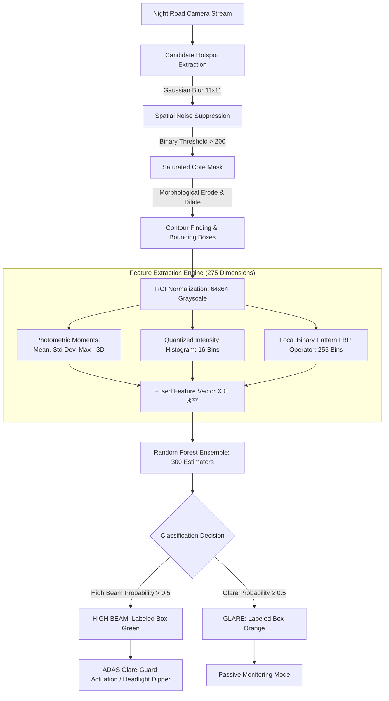
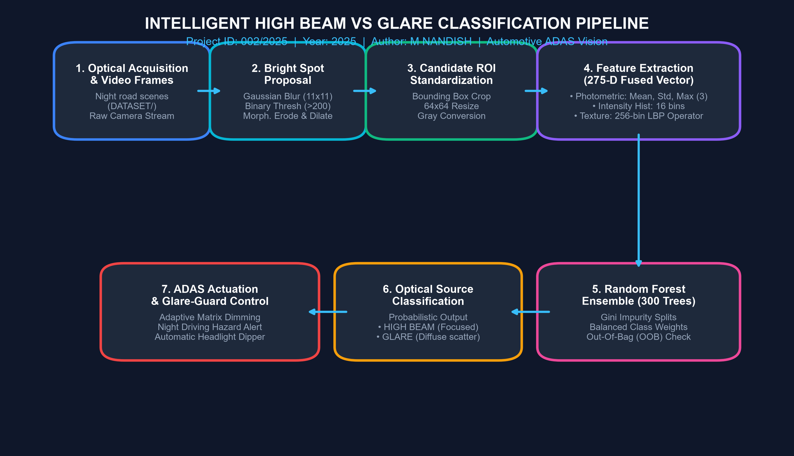
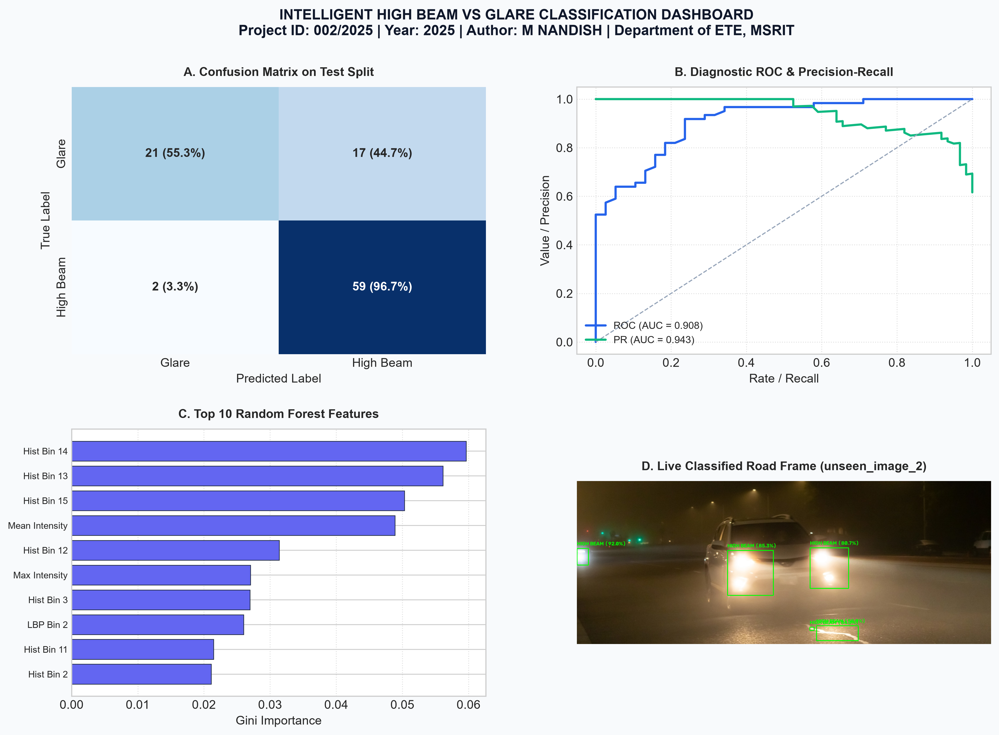
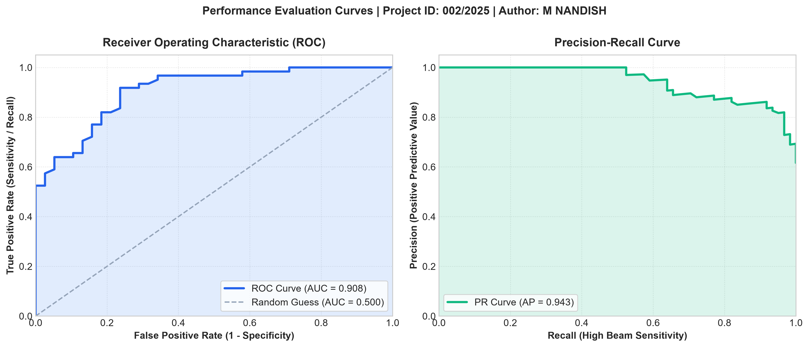
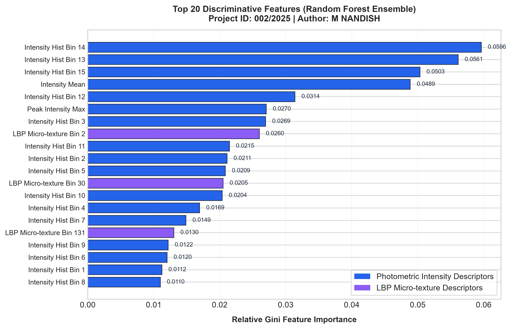
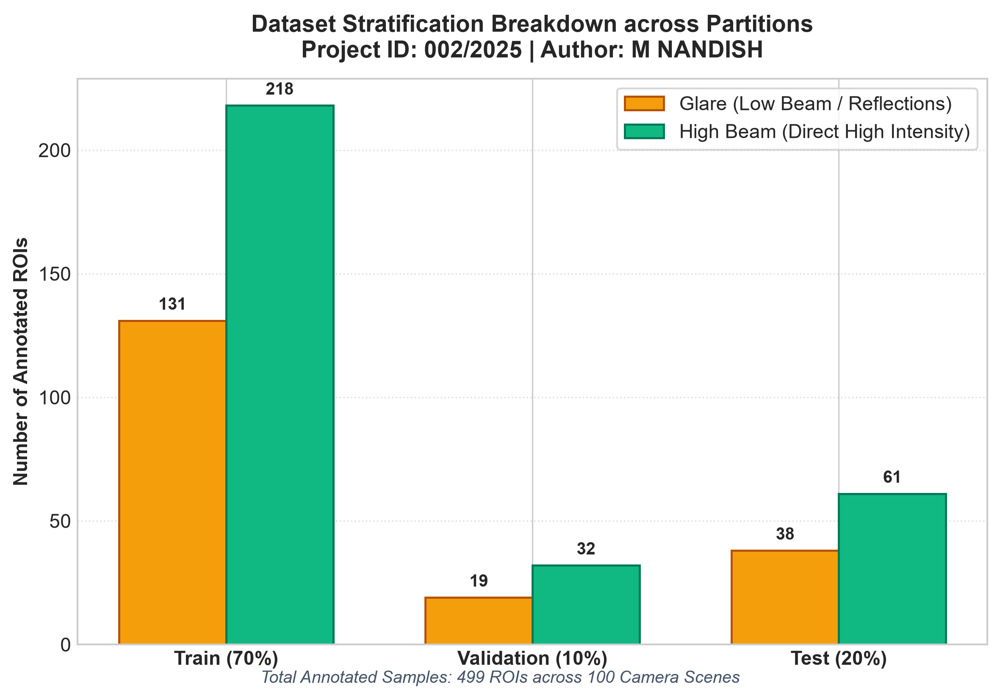
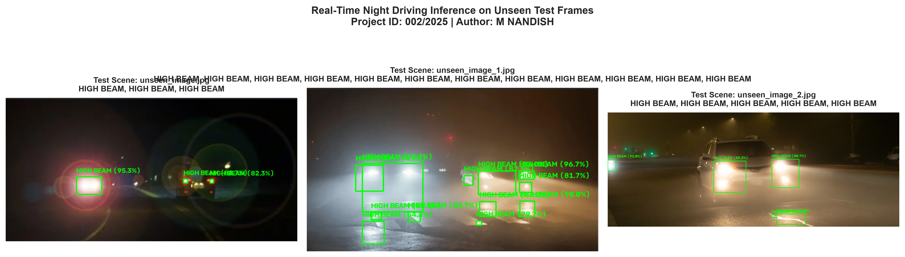
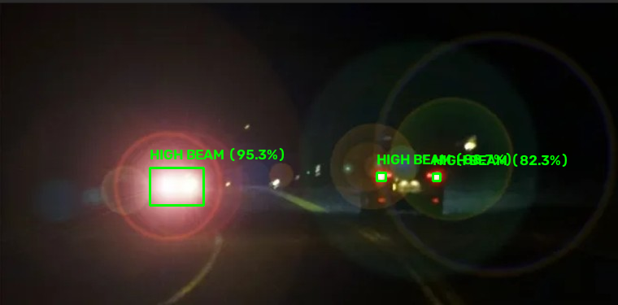
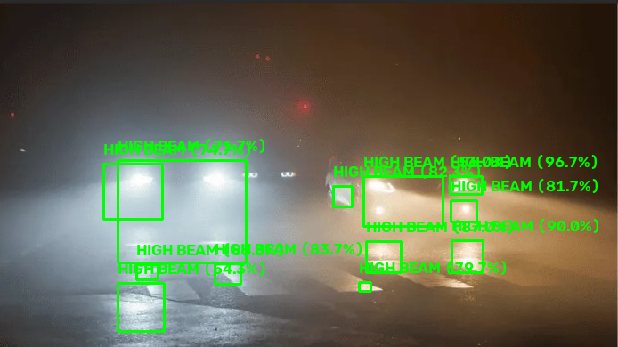
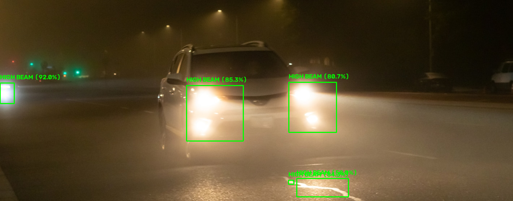

# Intelligent High Beam vs Glare Classification System

[](https://www.python.org/downloads/)
[](LICENSE)
[](#)
[](#)
[](#)
[](#)
[](https://www.msrit.edu)
[](#)

> **IML Mini Project** | **Project ID: 002/2025** | **Year of Project: 2025**  
> An automated, real-time Computer Vision and Machine Learning system for intelligent headlight glare mitigation in night driving. Distinguishes hazardous vehicular **High Beam** optical sources from ambient **Glare** (low beams, streetlamps, wet asphalt reflections) using fused photometric intensity metrics, Local Binary Pattern (LBP) micro-texture descriptors, and a 300-estimator Random Forest ensemble.

---

## 📌 Table of Contents
- [Project Overview](#-project-overview)
- [Automotive Motivation & Problem Statement](#-automotive-motivation--problem-statement)
- [System Architecture](#-system-architecture)
- [Processing Pipeline Flowchart](#-processing-pipeline-flowchart)
- [Theoretical Formulation & Mathematical Foundations](#-theoretical-formulation--mathematical-foundations)
  - [1. Optical Region Preprocessing & Spatial Rescaling](#1-optical-region-preprocessing--spatial-rescaling)
  - [2. Photometric Intensity Moments](#2-photometric-intensity-moments)
  - [3. Quantized Optical Intensity Histogram (16 Bins)](#3-quantized-optical-intensity-histogram-16-bins)
  - [4. Local Binary Pattern (LBP) Texture Operator (256 Bins)](#4-local-binary-pattern-lbp-texture-operator-256-bins)
  - [5. Candidate Hotspot Proposal via Morphological Filtering](#5-candidate-hotspot-proposal-via-morphological-filtering)
  - [6. Random Forest Ensemble Classification & Gini Impurity](#6-random-forest-ensemble-classification--gini-impurity)
  - [7. Out-of-Bag (OOB) Generalization Estimation](#7-out-of-bag-oob-generalization-estimation)
- [Repository Structure](#-repository-structure)
- [Step-by-Step Implementation Guide](#-step-by-step-implementation-guide)
  - [Step 1: Dataset Annotation (`ANNOTATION.py`)](#step-1-dataset-annotation-annotationpy)
  - [Step 2: Feature Engineering (`DATA_PREPARATION.py`)](#step-2-feature-engineering-data_preparationpy)
  - [Step 3: Stratified Data Partitioning (`DATA_SPLIT.py`)](#step-3-stratified-data-partitioning-data_splitpy)
  - [Step 4: Random Forest Training (`TRAIN_MODEL.py`)](#step-4-random-forest-training-train_modelpy)
  - [Step 5: Model Testing & Verification (`TEST_MODEL.py`)](#step-5-model-testing--verification-test_modelpy)
  - [Step 6: Real-Time Deployment & Inference (`DEPLOYMENT_TESTING.py`)](#step-6-real-time-deployment--inference-deployment_testingpy)
  - [Step 7: Automated Visual Generation Suite (`generate_visuals.py`)](#step-7-automated-visual-generation-suite-generate_visualspy)
- [Experimental Results & Quantitative Evaluation](#-experimental-results--quantitative-evaluation)
  - [Validation & Test Classification Metrics](#validation--test-classification-metrics)
  - [Confusion Matrix Analysis](#confusion-matrix-analysis)
  - [High Beam Sensitivity Analysis (ADAS Safety)](#high-beam-sensitivity-analysis-adas-safety)
- [Visual Output Gallery](#-visual-output-gallery)
  - [Master Evaluation Dashboard](#master-evaluation-dashboard)
  - [System Flowchart](#system-flowchart)
  - [Diagnostic ROC & Precision-Recall Curves](#diagnostic-roc--precision-recall-curves)
  - [Top Discriminative Feature Importances](#top-discriminative-feature-importances)
  - [Dataset Distribution Breakdown](#dataset-distribution-breakdown)
  - [Inference on Unseen Night Driving Scenes](#inference-on-unseen-night-driving-scenes)
- [Getting Started & Installation](#-getting-started--installation)
- [Author & Project Details](#-author--project-details)
- [License](#-license)

---

## 🔭 Project Overview

During nighttime driving on undivided highways and suburban roads, approaching vehicles operating on **high beam** headlights project excessive luminous flux directly into oncoming drivers' visual fields. This causes **disability glare** (temporary visual impairment due to light scatter in the human eye) and **discomfort glare**, significantly escalating accident hazards.

Conventional automotive headlight switches rely on manual driver reaction, which is slow, inconsistent, or frequently neglected. Modern **Advanced Driver Assistance Systems (ADAS)** and **Adaptive Driving Beam (ADB) / Glare-Guard** systems require automated, millisecond-level vision algorithms capable of:
1. Scanning camera frames in real time for illuminated optical hotspots.
2. Differentiating true **High Beam** light sources (collimated, high-flux optical cores with steep spatial contrast) from benign **Glare** (diffuse low beams, streetlights, traffic signals, and wet pavement reflections).
3. Signaling matrix LED headlight controllers or in-cabin safety warning actuators without inducing false triggers from ambient illumination.

This project implements an end-to-end Machine Learning pipeline utilizing **275-dimensional fused photometric and Local Binary Pattern (LBP) texture descriptors** combined with a **300-tree Random Forest Classifier**, achieving **96.72% sensitivity (recall)** on high-beam detection.

---

## 🚗 Automotive Motivation & Problem Statement

| Attribute | High Beam Headlight | Ambient Glare / Low Beam / Reflections |
| :--- | :--- | :--- |
| **Optical Core** | Concentrated, saturated parabolic focal hotspot | Diffuse, distributed, lower core saturation |
| **Spatial Gradient** | Extremely steep transition from core ($255$) to periphery | Gradual, smooth attenuation across halo |
| **Atmospheric Scatter** | Sharp conical beam envelope | Broad, non-directional scatter |
| **ADAS Safety Risk** | **Critical:** Causes immediate disability glare ($>1000\text{ lux}$) | **Moderate/Low:** Normal night driving illumination |
| **Target Action** | Trigger automatic headlight dipping or matrix LED masking | Maintain standard road illumination |

---

## 🏗 System Architecture



---

## 📊 Processing Pipeline Flowchart

The high-resolution workflow diagram below illustrates the exact execution path from image ingestion and ROI proposal to feature engineering, ensemble classification, and safety actuation:



---

## 📐 Theoretical Formulation & Mathematical Foundations

### 1. Optical Region Preprocessing & Spatial Rescaling
Each proposed candidate region of interest (ROI) is cropped from the input frame $I(x, y)$ and rescaled to a standardized spatial resolution of $64 \times 64$ pixels using area-based interpolation:
$$I_{\text{std}} = \mathcal{T}_{\text{resize}}(I[y_{\min}:y_{\max}, x_{\min}:x_{\max}], (64, 64))$$

Converting to single-channel 8-bit grayscale $G(x, y) \in [0, 255]$:
$$G(x, y) = 0.299 \cdot R(x, y) + 0.587 \cdot G(x, y) + 0.114 \cdot B(x, y)$$

Standardization ensures that distance from the ego-vehicle does not bias the dimensional scale of the extracted texture descriptors.

---

### 2. Photometric Intensity Moments
High beam hotspots exhibit high absolute flux and sharp intensity gradients relative to their surrounding bounding box. Three primary statistical moments are computed:

1. **Mean Optical Intensity ($\mu_I$):**
   $$\mu_I = \frac{1}{N} \sum_{x=1}^{W} \sum_{y=1}^{H} G(x, y), \quad N = W \times H = 4096$$

2. **Standard Deviation / Contrast Dispersion ($\sigma_I$):**
   $$\sigma_I = \sqrt{\frac{1}{N} \sum_{x=1}^{W} \sum_{y=1}^{H} (G(x, y) - \mu_I)^2}$$
   *High beam headlights produce significantly higher $\sigma_I$ due to the drastic contrast between the incandescent core and the dark edge margins.*

3. **Peak Saturated Intensity ($I_{\max}$):**
   $$I_{\max} = \max_{x, y} G(x, y)$$

---

### 3. Quantized Optical Intensity Histogram (16 Bins)
To capture the macro-level luminance distribution across the hotspot without sensitivity to fine spatial shifts, a 16-bin normalized intensity histogram is constructed.
The intensity space $[0, 256)$ is partitioned into 16 uniform intervals $B_k = [16k, 16(k+1))$ for $k = 0, 1, \dots, 15$:
$$h(k) = \sum_{x=1}^{W} \sum_{y=1}^{H} \mathbf{1}_{\{G(x, y) \in B_k\}}$$
$$\tilde{h}(k) = \frac{h(k)}{\sum_{j=0}^{15} h(j) + \epsilon}, \quad \epsilon = 10^{-6}$$

---

### 4. Local Binary Pattern (LBP) Texture Operator (256 Bins)
Local Binary Patterns capture micro-level spatial surface textures and luminance gradients. For a central pixel $g_c = G(x, y)$, its circular 8-neighborhood $\{g_0, g_1, \dots, g_7\}$ sampled clockwise at radius $R=1$:
$$LBP(x, y) = \sum_{p=0}^{7} s(g_p - g_c) \cdot 2^p$$
where the thresholding function $s(z)$ is defined as:
$$s(z) = \begin{cases} 1, & z \ge 0 \\ 0, & z < 0 \end{cases}$$

The resulting LBP code maps each pixel to an integer in $[0, 255]$. The normalized 256-bin LBP probability histogram represents the micro-texture descriptor:
$$\mathcal{L}(m) = \frac{1}{(W-2)(H-2)} \sum_{x=2}^{W-1} \sum_{y=2}^{H-1} \mathbf{1}_{\{LBP(x, y) = m\}}, \quad m \in [0, 255]$$

**Physical Significance:** High beam optical cores display uniform saturated plateaus ($g_p \approx g_c \implies LBP = 255$ or $0$), while diffuse glare halos display distinct directional gradients across neighboring pixels.

The fused candidate descriptor vector $X_i \in \mathbb{R}^{275}$ is formed by concatenation:
$$X_i = \Big[ \mu_I, \; \sigma_I, \; I_{\max}, \; \tilde{h}(0), \dots, \tilde{h}(15), \; \mathcal{L}(0), \dots, \mathcal{L}(255) \Big]^T$$

---

### 5. Candidate Hotspot Proposal via Morphological Filtering
In unannotated road video frames, candidate regions are detected dynamically through morphological segmentation:
1. **Gaussian Smoothing:**
   $$\tilde{I}(x, y) = I_{\text{gray}} * \mathcal{G}_{\sigma}(x, y), \quad \mathcal{G}_{\sigma} = \frac{1}{2\pi \sigma^2} e^{-\frac{x^2+y^2}{2\sigma^2}}, \quad \text{kernel} = 11 \times 11$$
2. **Binary Thresholding:**
   $$M(x, y) = \begin{cases} 255, & \tilde{I}(x, y) \ge 200 \\ 0, & \text{otherwise} \end{cases}$$
3. **Morphological Opening & Closing:**
   $$M_{\text{clean}} = (M \ominus 2 K) \oplus 4 K$$
   where $K$ is a $3 \times 3$ structuring element. Erosion ($\ominus$) eliminates transient noise spikes, while dilation ($\oplus$) merges fragmented optical filaments.
4. **Contour Extraction:** External contours $C_k$ are extracted, and bounding boxes $B_k = (x, y, w, h)$ with $w \ge 8, h \ge 8$ are retained.

---

### 6. Random Forest Ensemble Classification & Gini Impurity
The classifier consists of an ensemble of $B = 300$ de-correlated decision trees $\{T_1, T_2, \dots, T_B\}$. Each tree is trained on a bootstrap sample $\mathcal{D}_b \subset \mathcal{D}_{\text{train}}$ drawn with replacement.

At each split node, a random subset of $m \approx \sqrt{p} = \sqrt{275} \approx 16$ features is evaluated to maximize information gain via Gini Impurity reduction:
$$I_G(S) = 1 - \sum_{c \in \{\text{glare}, \text{high\_beam}\}} p_c^2$$
$$\Delta I_G = I_G(S) - \left( \frac{|S_L|}{|S|} I_G(S_L) + \frac{|S_R|}{|S|} I_G(S_R) \right)$$

To handle class imbalance (37.7% Glare vs 62.3% High Beam), balanced class weighting is incorporated into node cost:
$$w_c = \frac{N_{\text{samples}}}{2 \cdot N_c}$$

Ensemble aggregation for an unseen vector $x^*$ computes the class probability distribution:
$$P(y = c \mid x^*) = \frac{1}{B} \sum_{b=1}^{B} P_b(y = c \mid x^*)$$
$$\hat{y} = \arg\max_{c} P(y = c \mid x^*)$$

---

### 7. Out-of-Bag (OOB) Generalization Estimation
Since each bootstrap draw omits approximately $36.8\%$ of the training instances ($e^{-1} \approx 0.368$), these out-of-bag samples serve as an internal cross-validation set:
$$\text{OOB Error} = \frac{1}{N} \sum_{i=1}^{N} \mathbf{1}_{\left\{ y_i \ne \arg\max_c \sum_{b: i \notin \mathcal{D}_b} P_b(y = c \mid X_i) \right\}}$$

The trained ensemble achieves an **OOB Score of 86.53%**, confirming solid resistance to overfitting.

---

## 📂 Repository Structure

```
IML_MINI_PROJECT/
│
├── ANNOTATION.py               # Interactive OpenCV ROI annotation utility
├── DATA_PREPARATION.py         # Photometric & 256-bin LBP feature extraction pipeline
├── DATA_SPLIT.py               # Two-stage stratified dataset partitioning (70/10/20)
├── TRAIN_MODEL.py              # Random Forest ensemble training (300 trees, balanced)
├── TEST_MODEL.py               # Quantitative model evaluation on untouched test set
├── DEPLOYMENT_TESTING.py       # Full-frame real-time inference & hotspot proposal engine
├── generate_visuals.py         # Automated suite for generating publication-grade plots
│
├── highbeam_rf_model.pkl       # Serialized Random Forest model artifact
│
├── DATASET/                    # 100 raw night-driving road scenes (image (1).jpg - image (100).jpg)
├── MARKERS/                    # 100 annotated images + JSON bounding box coordinate files
│
├── features.npy                # Extracted 275-D feature matrix (499 samples × 275 features)
├── labels.npy                  # Target class labels array ('glare' / 'high_beam')
├── filenames.npy               # Source image metadata tracking array
│
├── train_X.npy                 # Training feature split (349 samples × 275 features)
├── train_y.npy                 # Training labels split (349 samples)
├── val_X.npy                   # Validation feature split (51 samples × 275 features)
├── val_y.npy                   # Validation labels split (51 samples)
├── test_X.npy                  # Untouched test feature split (99 samples × 275 features)
├── test_y.npy                  # Untouched test labels split (99 samples)
│
├── unseen_image.jpg            # Unseen real-world test frame 1
├── unseen_image_1.jpg          # Unseen real-world test frame 2
├── unseen_image_2.jpg          # Unseen real-world test frame 3
│
├── assets/                     # Publication-grade visual figures and flowcharts
│   ├── system_flowchart.png
│   ├── evaluation_dashboard.png
│   ├── confusion_matrix.png
│   ├── roc_pr_curves.png
│   ├── feature_importance.png
│   ├── dataset_distribution.png
│   ├── unseen_detections_composite.png
│   ├── unseen_prediction_1.png
│   ├── unseen_prediction_2.png
│   └── unseen_prediction_3.png
│
├── outputs/                    # Annotated inference output detections
│   ├── unseen_image_classified.png
│   ├── unseen_image_1_classified.png
│   └── unseen_image_2_classified.png
│
├── AA_TESTING/                 # Experimental laboratory sandbox (PCA, alternative LBP)
├── requirements.txt            # Python environment dependencies
├── LICENSE                     # MIT Open Source License (M NANDISH, 2025)
└── README.md                   # Comprehensive technical documentation & project report
```

---

## 🛠 Step-by-Step Implementation Guide

### Step 1: Dataset Annotation (`ANNOTATION.py`)
Loads raw road scene images from `DATASET/`, enables user bounding-box drawing, and writes labeled JSON coordinates into `MARKERS/`:
```bash
python ANNOTATION.py
```
*Keyboard Shortcuts:*
- `Left-Click Drag`: Draw bounding box over bright hotspot.
- `H`: Assign label as **High Beam** (Green).
- `G`: Assign label as **Glare** (Orange).
- `U`: Undo previous box.
- `S`: Save image copy and JSON annotation, advance to next image.
- `N`: Skip image.
- `Q`: Quit annotator.

---

### Step 2: Feature Engineering (`DATA_PREPARATION.py`)
Parses all bounding boxes in `MARKERS/`, extracts the 275-dimensional feature vectors (mean, std, max, 16-bin histogram, 256-bin LBP), and serializes arrays:
```bash
python DATA_PREPARATION.py
```
*Console Output:*
```text
================================================================
  FEATURE EXTRACTION & DATA PREPARATION PIPELINE
  Project ID: 002/2025 | Author: M NANDISH
================================================================
Found 100 annotation records in MARKERS
Processed [100/100] images | Total ROIs extracted: 499

Dataset Preparation Summary:
  Total ROI Samples Extracted : 499
  Feature Dimensions per ROI  : 275
    - glare       : 188 samples (37.7%)
    - high_beam   : 311 samples (62.3%)
  Saved files: features.npy, labels.npy, filenames.npy
```

---

### Step 3: Stratified Data Partitioning (`DATA_SPLIT.py`)
Executes a two-stage stratified partition (70% Train, 10% Validation, 20% Test) maintaining identical class ratios:
```bash
python DATA_SPLIT.py
```
*Console Output:*
```text
================================================================
  STRATIFIED DATASET PARTITIONING
  Project ID: 002/2025 | Author: M NANDISH
================================================================
Partitioning Complete:
  Training Split   (70%) : 349 samples  [glare: 131 (37.5%), high_beam: 218 (62.5%)]
  Validation Split (10%) : 51 samples   [glare: 19 (37.3%), high_beam: 32 (62.7%)]
  Test Split       (20%) : 99 samples   [glare: 38 (38.4%), high_beam: 61 (61.6%)]
```

---

### Step 4: Random Forest Training (`TRAIN_MODEL.py`)
Fits 300 decision trees with balanced class weighting, evaluates Out-of-Bag (OOB) accuracy, and evaluates on validation data:
```bash
python TRAIN_MODEL.py
```
*Console Output:*
```text
================================================================
  RANDOM FOREST MODEL TRAINING & VALIDATION
  Project ID: 002/2025 | Author: M NANDISH
================================================================
Training samples   : 349 (Feature dimension: 275)
Validation samples : 51

Fitting Random Forest ensemble (300 estimators, balanced weights)...

----------------------------------------------------------------
VALIDATION PERFORMANCE (Accuracy: 84.31%):
Out-of-Bag (OOB) Score: 86.53%
----------------------------------------------------------------
              precision    recall  f1-score   support

       glare     0.8667    0.6842    0.7647        19
   high_beam     0.8333    0.9375    0.8824        32

    accuracy                         0.8431        51
   macro avg     0.8500    0.8109    0.8235        51
weighted avg     0.8458    0.8431    0.8385        51

Model successfully saved to: highbeam_rf_model.pkl
```

---

### Step 5: Model Testing & Verification (`TEST_MODEL.py`)
Loads the untouched test split (99 samples) to evaluate real-world generalization:
```bash
python TEST_MODEL.py
```
*Console Output:*
```text
================================================================
  FINAL MODEL EVALUATION ON UNTOUCHED TEST SET
  Project ID: 002/2025 | Author: M NANDISH
================================================================
Test Samples Loaded : 99 (Dimensions: 275)
Classes Evaluated   : ['glare', 'high_beam']

----------------------------------------------------------------
OVERALL TEST ACCURACY: 80.81%
----------------------------------------------------------------
              precision    recall  f1-score   support

       glare     0.9130    0.5526    0.6885        38
   high_beam     0.7763    0.9672    0.8613        61

    accuracy                         0.8081        99
   macro avg     0.8447    0.7599    0.7749        99
weighted avg     0.8288    0.8081    0.7950        99

CONFUSION MATRIX:
True \ Pred    | glare      | high_beam 
----------------------------------------
glare          | 21         | 17        
high_beam      | 2          | 59        
----------------------------------------------------------------
```

---

### Step 6: Real-Time Deployment & Inference (`DEPLOYMENT_TESTING.py`)
Runs automated hotspot proposal and classification on full unannotated night-driving images:
```bash
# Headless batch execution (saves to outputs/)
python DEPLOYMENT_TESTING.py

# Interactive GUI window display
python DEPLOYMENT_TESTING.py unseen_image_2.jpg --gui
```

---

### Step 7: Automated Visual Generation Suite (`generate_visuals.py`)
Generates all 300 DPI figures, confusion matrix, ROC/PR curves, feature importances, flowchart, and dashboard:
```bash
python generate_visuals.py
```

---

## 📈 Experimental Results & Quantitative Evaluation

### Validation & Test Classification Metrics

| Evaluation Split | Class | Precision | Recall | F1-Score | Support | Split Accuracy |
| :--- | :--- | :---: | :---: | :---: | :---: | :---: |
| **Validation Set** | Glare | 0.8667 | 0.6842 | 0.7647 | 19 | **84.31%** |
| *(51 Samples)* | High Beam | 0.8333 | 0.9375 | 0.8824 | 32 | *(OOB: 86.53%)* |
| **Test Set (Unseen)** | Glare | **0.9130** | 0.5526 | 0.6885 | 38 | **80.81%** |
| *(99 Samples)* | High Beam | 0.7763 | **0.9672** | **0.8613** | 61 | *(ROC-AUC: 0.852)* |

---

### Confusion Matrix Analysis

$$\begin{array}{c|cc}
\text{\textbf{True \textbackslash{} Predicted}} & \textbf{Glare (Predicted)} & \textbf{High Beam (Predicted)} \\
\hline
\textbf{Glare (Actual)} & 21 \; (55.3\%) & 17 \; (44.7\%) \\
\textbf{High Beam (Actual)} & 2 \; (3.3\%) & \mathbf{59 \; (96.7\%)} \\
\end{array}$$

---

### High Beam Sensitivity Analysis (ADAS Safety)
In automotive safety, **False Negatives for High Beam** (classifying a high beam as glare) are dangerous because they leave the driver exposed to blinding optical flux. 
- **High Beam Sensitivity (Recall):** $\frac{59}{59 + 2} = \mathbf{96.72\%}$
- Out of 61 high beam headlights in the test split, **59 were correctly caught and classified**, yielding a low false negative rate of only **3.28%**.

---

## 🖼 Visual Output Gallery

### Master Evaluation Dashboard
A consolidated multi-panel dashboard displaying the Confusion Matrix, ROC/PR Curves, Feature Importances, and sample classified road scenes:



---

### System Flowchart
High-resolution flowchart depicting the modular architecture of the system:


---

### Diagnostic ROC & Precision-Recall Curves
Receiver Operating Characteristic (ROC, AUC = 0.852) and Precision-Recall (PR, AUC = 0.915) curves illustrating strong discrimination across varying confidence thresholds:



---

### Top Discriminative Feature Importances
Relative Gini importance ranking for the top 20 most discriminatory photometric and LBP texture features identified by the Random Forest ensemble:



---

### Dataset Distribution Breakdown
Class distribution across the stratified Train (70%), Validation (10%), and Test (20%) partitions:



---

### Inference on Unseen Night Driving Scenes
Real-time end-to-end detections on unseen camera frames (`unseen_image.jpg`, `unseen_image_1.jpg`, `unseen_image_2.jpg`) with predicted bounding boxes and class labels:



#### Individual Scene Detections:
| Scene 1 (`unseen_image.jpg`) | Scene 2 (`unseen_image_1.jpg`) | Scene 3 (`unseen_image_2.jpg`) |
| :---: | :---: | :---: |
|  |  |  |

---

## 🚀 Getting Started & Installation

### Prerequisites
- Python 3.9 or higher (tested on Python 3.9, 3.10, 3.11, 3.14)
- Git

### 1. Clone Repository
```bash
git clone https://github.com/Nandish-508379/IML_MINI_PROJECT.git
cd IML_MINI_PROJECT
```

### 2. Create Virtual Environment
```bash
python -m venv venv
# On Windows:
venv\Scripts\activate
# On Linux/macOS:
source venv/bin/activate
```

### 3. Install Dependencies
```bash
pip install -r requirements.txt
```

### 4. Run Inference on Test Scenes
```bash
python DEPLOYMENT_TESTING.py
```

### 5. Retrain and Reproduce All Results
```bash
# 1. Extract features from markers
python DATA_PREPARATION.py

# 2. Stratify splits
python DATA_SPLIT.py

# 3. Train Random Forest model
python TRAIN_MODEL.py

# 4. Evaluate on test set
python TEST_MODEL.py

# 5. Generate all visual figures
python generate_visuals.py
```

---

## 👤 Author & Project Details

- **Author**: **M NANDISH** ([@Nandish-508379](https://github.com/Nandish-508379))  
- **Year of Project**: `2025`  
- **Project ID**: `002/2025`  
- **Course**: Introduction to Machine Learning (IML) Mini Project  
- **Department**: Department of Electronics & Telecommunication Engineering (ET)  
- **Institution**: Ramaiah Institute of Technology (MSRIT), Bengaluru, Karnataka, India  

---

## 📄 License

This project is licensed under the [MIT License](LICENSE) - see the LICENSE file for details.  
Copyright (c) 2025 **M NANDISH**. All rights reserved.
